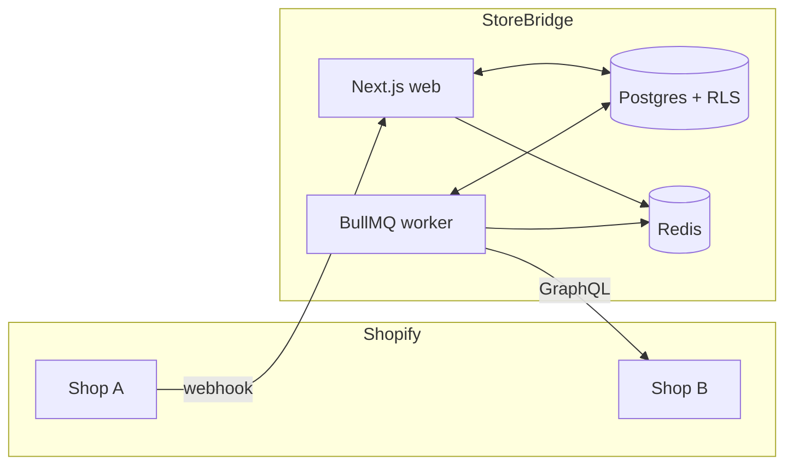

# StoreBridge

> Multi-tenant Shopify SaaS that synchronizes inventory between stores. Built as an architecture showcase — the interesting parts are the tenant isolation, the HMAC boundary, and the audit trail, not the demo feature.

[](https://github.com/atifali-pm/storebridge/actions/workflows/ci.yml)
[](https://www.typescriptlang.org/)
[](./docs/ARCHITECTURE.md#multi-tenancy-model)
[](./tests)

## What it does

Merchants install StoreBridge on **two or more of their Shopify stores**. When inventory changes in one store, StoreBridge propagates the new on-hand quantity to the matched SKU in the other store — within seconds, over signed webhooks, serialized through a BullMQ worker.

Small, well-scoped feature. The reason this repo exists is everything around it:

- **Two-layer tenant isolation** — every query is tenant-scoped in application code *and* Postgres Row-Level Security. Proven by a 16-assertion integration suite that attempts cross-tenant SELECT/UPDATE/DELETE/INSERT and verifies they fail.
- **HMAC-verified webhooks** — raw body read before JSON parse, `crypto.timingSafeEqual`, idempotent via a unique `shopify_webhook_id` index.
- **AES-256-GCM at rest** — access tokens encrypted in Postgres with random IV + auth tag.
- **Merchant merge flow** — HMAC-signed tokens let a second shop install attach to an existing tenant without trusting user-supplied IDs.
- **Audit log on every mutation** — IP, user agent, action, before/after meta.
- **Rate limiter** — per-shop serial queue stays under Shopify's 40 req/s budget.

Full threat table with evidence paths in [docs/SECURITY-AUDIT.md](./docs/SECURITY-AUDIT.md). System and data diagrams in [docs/ARCHITECTURE.md](./docs/ARCHITECTURE.md).

## Stack

| Layer | Choice |
|---|---|
| Framework | Next.js 16 (App Router, strict TS) |
| Database | Postgres 16 + Drizzle ORM, migrations in-repo |
| Queue | BullMQ on Redis |
| Shopify | `@shopify/shopify-api`, `@shopify/app-bridge-react`, `@shopify/polaris` (GraphQL Admin API, 2025-01) |
| Validation | Zod on every request boundary |
| Logging | pino with secret redaction |
| Testing | Vitest (unit) + Vitest with real Postgres (tenant-isolation) |
| Hosting | Railway (web + worker services, free tier) |

## Architecture at a glance



Detail in [docs/ARCHITECTURE.md](./docs/ARCHITECTURE.md).

## Quick start

Prereqs: **Node 22**, **pnpm 9**, **Docker** (for local Postgres + Redis).

```bash
# install
pnpm install

# local services
pnpm db:up          # Postgres on 5436, Redis on 6390

# env
cp .env.example .env.local
# fill in SHOPIFY_API_KEY, SHOPIFY_API_SECRET, APP_ENCRYPTION_KEY
#   (openssl rand -base64 32 for the key)

# schema
pnpm db:migrate

# run
pnpm dev            # web on :3000
pnpm worker         # in a second terminal
```

To install on a live Shopify dev store, tunnel `:3000` over HTTPS and follow [docs/SHOPIFY-SETUP.md](./docs/SHOPIFY-SETUP.md).

## Scripts

| | |
|---|---|
| `pnpm dev` | Next dev server |
| `pnpm worker` | BullMQ inventory-sync worker |
| `pnpm build` | Production build |
| `pnpm typecheck` | `tsc --noEmit` |
| `pnpm lint` | ESLint |
| `pnpm test` | Unit tests (37) |
| `pnpm test:isolation` | Postgres-backed tenant-isolation tests (16) |
| `pnpm db:generate` | Drizzle migration from schema changes |
| `pnpm db:migrate` | Apply migrations |
| `pnpm db:studio` | Drizzle Studio |

## Repo map

```
src/
  app/
    app/                  — Shopify embedded admin (Polaris + App Bridge)
    api/
      auth/shopify/       — OAuth install + callback
      webhooks/shopify/   — HMAC-verified webhook ingress
      health/             — DB liveness
  db/
    schema.ts             — Drizzle schema (tenants, shops, users, store_links, audit_logs, webhook_events, sync_jobs)
    migrations/0003_*.sql — RLS policies and app_user role
    tenant-scope.ts       — withTenant() — the tenant-scoping boundary
  lib/
    crypto.ts             — AES-256-GCM helpers
    merge-token.ts        — HMAC-signed merge tokens
    rate-limit.ts         — per-shop outbound rate limiter
    shopify/              — OAuth, HMAC, GraphQL, webhook subscription
  workers/
    inventory-sync.worker.ts
tests/
  unit/                   — 37 tests (HMAC, crypto, merge-token, rate limit, shop domain)
  tenant-isolation/       — 16 tests against real Postgres
docs/
  ARCHITECTURE.md         — component diagram, ERD, sequence flows (mermaid)
  SECURITY-AUDIT.md       — 13-threat table with evidence paths + 8 known gaps
  SHOPIFY-SETUP.md        — Partner dashboard walkthrough
  DEPLOYMENT.md           — Railway deploy runbook
```

## Status and roadmap

| Phase | Status |
|---|---|
| Phase 1 — Scaffold + Drizzle + Postgres | ✅ |
| Phase 2 — Shopify OAuth + embedded admin shell | ✅ |
| Phase 3 — Webhooks + BullMQ worker + admin UI | ✅ |
| Phase 4 — RLS + isolation suite + rate limit + audit docs | ✅ |
| Phase 5 — Railway deploy + CI + README polish | ✅ |

## License

MIT.
