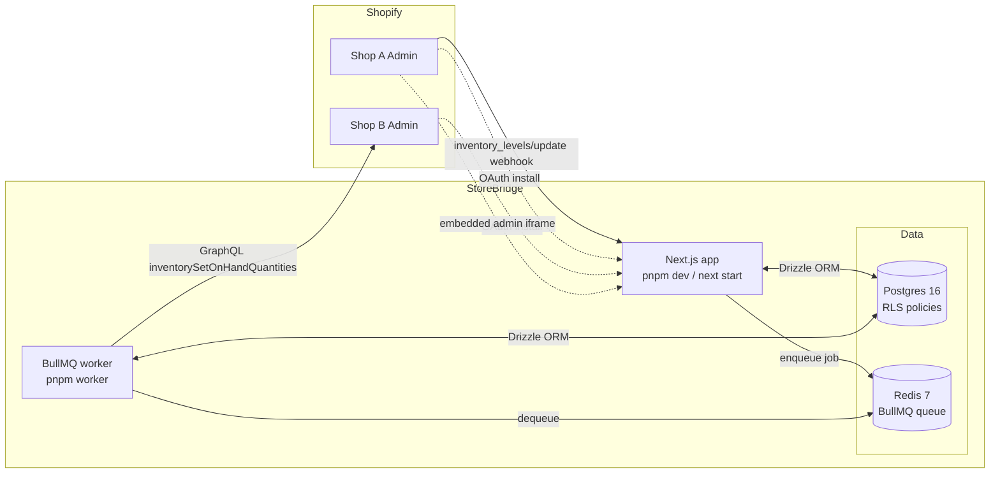
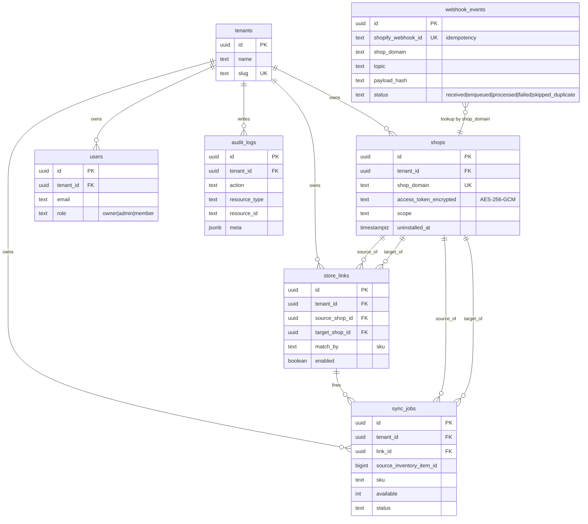
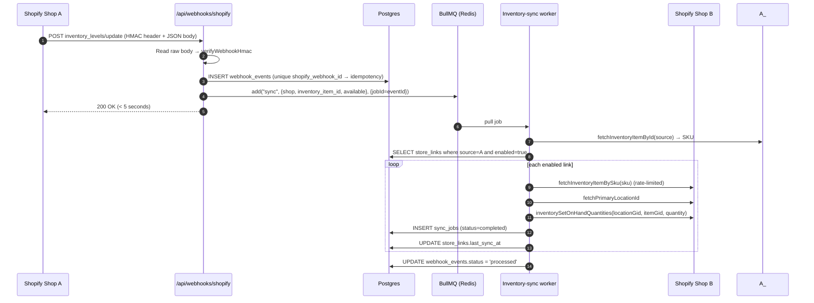

# Architecture

StoreBridge is a multi-tenant Shopify app that synchronizes inventory between two or more stores owned by the same merchant. This document describes how the system is put together.

## Table of contents

1. [Components](#components)
2. [System diagram](#system-diagram)
3. [Data model](#data-model)
4. [Multi-tenancy model](#multi-tenancy-model)
5. [OAuth install flow](#oauth-install-flow)
6. [Inventory sync flow](#inventory-sync-flow)
7. [Queue architecture](#queue-architecture)
8. [Admin UI](#admin-ui)
9. [Observability](#observability)
10. [Runtime topology](#runtime-topology)

## Components

| Component | Responsibility |
|---|---|
| **Next.js app** (App Router) | Public landing, embedded merchant admin at `/app`, OAuth routes, webhook handler, `/api/health` |
| **BullMQ worker** (`pnpm worker`) | Consumes the `storebridge-inventory-sync` queue and pushes inventory updates to target shops |
| **Postgres 16** | All tenant data, with RLS policies scoping rows to the current tenant |
| **Redis 7** | BullMQ queue backing store |
| **Shopify Admin API** | Source of webhooks, target of inventory updates (GraphQL) |

## System diagram



## Data model



## Multi-tenancy model

Two layers of tenant scoping:

**Layer 1 — application scope.** Every `SELECT/INSERT/UPDATE/DELETE` on a tenant-owned table includes an explicit `tenant_id` match in the query. Server actions pass `tenantId` in the form payload and Zod-validate it.

**Layer 2 — row-level security (Postgres).** Every tenant-owned table has RLS policies keyed to `current_setting('storebridge.tenant_id')::uuid`. The app connects as the owner role by default (which bypasses RLS for system paths like webhooks and migrations), but **tenant-scoped code paths must wrap queries in `withTenant()`**:

```ts
await withTenant(tenantId, async (tx) => {
  await tx.insert(storeLinks).values({ ... });   // RLS-scoped
  await tx.select().from(shops);                  // sees only tenant's shops
});
```

`withTenant` opens a transaction, issues `SET LOCAL ROLE app_user` and `SELECT set_config('storebridge.tenant_id', $1, true)`, runs the callback, and commits/rolls back. When the transaction ends the role and setting revert. `tenantId` is validated against a UUID regex before reaching SQL — no interpolation attack surface.

The [tenant-isolation test suite](../tests/tenant-isolation/rls.test.ts) proves isolation with 16 assertions, including SELECT/UPDATE/DELETE/INSERT attempts across tenants, fail-closed behavior when the tenant GUC is unset, and a SQL-injection probe via the tenant id parameter.

Run it:

```bash
pnpm test:isolation
```

## OAuth install flow

```mermaid
sequenceDiagram
  autonumber
  participant M as Merchant (Shopify admin)
  participant N as Next.js /api/auth/shopify/install
  participant S as Shopify OAuth
  participant C as Next.js /api/auth/shopify/callback
  participant DB as Postgres
  participant WH as Webhook registrar

  M->>N: GET ?shop=foo.myshopify.com (+merge_into token)
  N->>N: Validate shop domain, gen 32-byte state
  N-->>M: 302 Shopify authorize URL; set state cookie
  M->>S: Approve scopes
  S->>C: GET ?code&hmac&shop&state&timestamp&host
  C->>C: Verify HMAC over query (timingSafeEqual)
  C->>C: Match state cookie vs query state
  C->>C: Verify merge_into HMAC token (if present)
  C->>S: POST /admin/oauth/access_token {code, client_id, client_secret}
  S-->>C: { access_token, scope }
  C->>S: GraphQL ShopInfo query
  C->>DB: Upsert tenant + shop (token AES-256-GCM encrypted)
  C->>WH: Register INVENTORY_LEVELS_UPDATE + APP_UNINSTALLED
  C-->>M: 302 https://{shop}/admin/apps/{api_key}
```

## Inventory sync flow



## Queue architecture

- **Queue name:** `storebridge-inventory-sync`
- **Backend:** Redis (local port 6390 in dev, Railway free-tier Redis in prod)
- **Concurrency:** 4 workers per process (`CONCURRENCY` in `src/workers/inventory-sync.worker.ts`)
- **Retries:** 5 attempts, exponential backoff starting at 1 s
- **Retention:** completed jobs kept 24 h (max 1000), failed kept 7 d
- **Idempotency:** the BullMQ `jobId` equals the `webhook_events.id`, so repeated deliveries from Shopify hit the unique index and never enqueue a second job

## Admin UI

- **Root:** `/app?shop=<shop>.myshopify.com&host=...` — Polaris shell served via Next.js App Router
- **CSP middleware** (`src/middleware.ts`) sets `frame-ancestors https://{shop} https://admin.shopify.com` only for `/app/*` — outside routes are not embeddable
- **App Bridge** loaded via Shopify CDN `<Script strategy="beforeInteractive">` in the embedded layout
- **Server Actions** mutate state via `withTenant()` → every write is RLS-scoped at the DB level
- **Merge flow:** "Connect another store" generates an HMAC-signed tenant token (15-min TTL) that the install route carries in the state cookie — the callback honors it to attach the newly-installed shop to the existing tenant

## Observability

- **Structured logs:** pino with token/cookie redaction (`src/lib/logger.ts`)
- **Audit log table** — every tenant-affecting action writes an `audit_logs` row with `{tenant_id, user_id, action, resource_type, resource_id, meta, ip_address, user_agent}`
- **Health check:** `GET /api/health` runs `SELECT 1` on Postgres and returns `{status, db, uptimeMs}`
- **Worker lifecycle:** `worker.completed` and `worker.failed` events are logged with `jobId` and `attemptsMade`
- **Error tracking (Sentry):** wired through `SENTRY_DSN` env var; falls back to pino if unset — see the security audit for rollout notes

## Runtime topology

Single Railway project with two services (free tier):

1. **Web** — `next start`, handles OAuth, webhooks, embedded admin, `/api/health`
2. **Worker** — `pnpm worker`, runs the BullMQ consumer

Both share the Railway Postgres add-on and Railway Redis add-on. Environment variables are identical for both services; the worker does not expose public endpoints.

For local dev: `pnpm db:up` brings up Postgres + Redis via Docker Compose (ports 5436 and 6390 to avoid conflicts), `pnpm dev` runs Next, `pnpm worker` runs the queue consumer.
